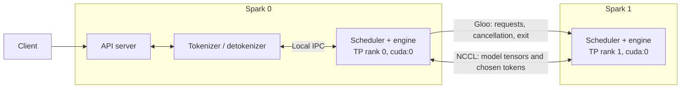

# Serving one model on two Sparks

Tensor parallelism (TP) splits each model layer between the two GPUs. Both Sparks participate in every inference step; neither node holds a separate serving replica. Start with a small model to check correctness before attempting a model that needs both machines' memory.

## Launch

Both Sparks need matching project dependencies and the same model revision. Keep the same model path on both nodes. For Hugging Face models, populate both caches before launch when possible. The launch configuration checks compare the model configuration and shared inference settings; they do not hash weight files.

Set `PARTIAL_NODE_0`, `PARTIAL_NODE_1`, and `PARTIAL_MASTER_ADDR` in ignored `.env.local`. The master address is Spark 0's ConnectX IP, reachable from both Sparks. `PARTIAL_MASTER_PORT` defaults to `29500`. The API port is separate and defaults to `1919`.

```bash
just serve-two Qwen/Qwen3-0.6B --host 0.0.0.0
```

This synchronizes source, launches both nodes concurrently, and prefixes their logs with node identity. The API starts only after both model workers and the local tokenizer workers are ready. Ctrl-C stops both nodes. If either SSH command exits, the launcher stops its peer. Source synchronization retains the existing `rsync --delete` behavior: use a dedicated remote project directory.

For a small initial check that limits cache allocation and disables CUDA graphs:

```bash
just serve-two Qwen/Qwen3-0.6B --host 0.0.0.0 \
    --graph 0 --num-pages 1024 --max-prefill-length 128
```

For separate-terminal debugging, run these concurrently:

```bash
just serve-node 0 Qwen/Qwen3-0.6B --host 0.0.0.0
just serve-node 1 Qwen/Qwen3-0.6B --host 0.0.0.0
```

The equivalent command on each Spark is:

```bash
.venv/bin/python -m minisgl --model Qwen/Qwen3-0.6B \
    --nnodes 2 --node-rank 0 --tp-size 2 \
    --dist-init-addr <spark-0-connectx-ip>:29500 --host 0.0.0.0
```

Use `--node-rank 1` on Spark 1. All inference settings must match, including graph sizes, cache settings, and overlap scheduling. Only Spark 0 serves HTTP. The offline `LLM` Python interface remains single-node.

## What runs where



1. Spark 0 tokenizes a request and broadcasts its serialized message to both schedulers.
2. Both schedulers select the same batch. Each engine runs its model shard and exchanges tensors over NCCL.
3. Rank 0 samples the next tokens and broadcasts them to rank 1. Both workers update their request state using those same tokens.
4. Rank 0 sends results to its detokenizer and API for delivery to the client.

Empty request batches are broadcast while idle, so a lost peer is detected even when there are no requests. GPU memory can differ between Sparks; cache capacity uses the smaller per-node budget. CUDA graph batch sizes also agree across ranks.

## Terms and code entry points

| Term | Meaning here |
| --- | --- |
| TP size | Total number of model shards: two for two Sparks. |
| Global TP rank | Shard identity, either 0 or 1. |
| Node rank | Which Spark the launcher runs on. With one GPU per Spark, this equals its global TP rank. |
| Local GPU index | Device number on this host. Both Sparks use GPU 0. |
| Rendezvous | The address where workers meet to establish their process groups. |
| NCCL | GPU tensor communication, including reductions and token broadcasts. |
| Gloo | CPU coordination for configuration, memory budgets, and scheduler messages. |

Read `server/launch.py` for process ownership, `server/workers.py` for supervision, `scheduler/io.py` for request coordination, and `engine/engine.py` for model execution and GPU communication. The model layers keep the existing TP sharding code.

## Transport and failures

Use the network settings that passed the existing two-node smoke test. Optional per-node overrides in `.env.local` include `PARTIAL_NODE_0_NCCL_SOCKET_IFNAME`, `PARTIAL_NODE_1_NCCL_SOCKET_IFNAME`, the corresponding `GLOO_SOCKET_IFNAME` settings, and `NCCL_IB_HCA`. Unprefixed exported values are also forwarded. The launcher does not guess interface names or force a transport.

The multi-node path uses PyTorch NCCL; single-host serving retains PyNCCL by default. `MINISGL_DISABLE_OVERLAP_SCHEDULING=1` is forwarded by the launch helper when exported locally, allowing validation of the non-overlap path.

`--startup-timeout` defaults to 600 seconds. CPU coordination during loading and initialization allows that startup timeout. Runtime collective coordination defaults to 120 seconds, configurable with `--distributed-timeout`. Native compilation or a stuck CUDA call is contained by parent-process supervision and bounded cleanup. After a peer fails, restart both nodes; there is no automatic failover or request recovery.

## Validation

```bash
just run 0 .venv/bin/python -m pytest tests/misc/test_multinode.py --no-cov -q
just run 0 .venv/bin/python tests/misc/check_serving.py
```

The serving check exercises greedy generation, streaming, concurrent requests, stochastic sampling, a long prompt, and client cancellation. Add `--idle-seconds 130` to check an idle period longer than the default runtime timeout. Run it with CUDA graphs enabled and disabled, and with overlap scheduling enabled and disabled.

To compare with TP=1, run a single-node server using the same model, dtype, and cache settings and save a baseline:

```bash
just run 0 .venv/bin/python tests/misc/check_serving.py --write-baseline /tmp/qwen-tp1.json
```

Then restart in TP=2 and compare:

```bash
just run 0 .venv/bin/python tests/misc/check_serving.py --baseline /tmp/qwen-tp1.json
```

This compares decoded greedy outputs. Record hardware, software versions, model revision, and commands when reporting results; decoded equality does not establish bitwise equality of model logits or tokens.

### Comparing actual token IDs

`check_token_parity.py` uses a test-only scheduler harness with real model execution. It records generated token IDs before detokenization, compares TP=2 greedy output against TP=1, and checks that both ranks use identical stochastic output IDs. It does not add a public multi-node offline API.

First save the TP=1 baseline on node 0:

```bash
just run 0 bash -c 'export PATH="$PWD/.venv/bin:$PATH"; .venv/bin/python tests/misc/check_token_parity.py --write-baseline /tmp/qwen-token-baseline.json'
```

Then run the following concurrently in separate terminals. Replace `SPARK_0_IP` with the same reachable ConnectX address used for serving. Stop any other job using port 29600 first.

```bash
just run 0 bash -c 'export PATH="$PWD/.venv/bin:$PATH"; .venv/bin/python tests/misc/check_token_parity.py --nnodes 2 --node-rank 0 --dist-init-addr SPARK_0_IP:29600 --baseline /tmp/qwen-token-baseline.json'
just run 1 bash -c 'export PATH="$PWD/.venv/bin:$PATH"; .venv/bin/python tests/misc/check_token_parity.py --nnodes 2 --node-rank 1 --dist-init-addr SPARK_0_IP:29600'
```

## Initial validation results — 2026-09-30

Both machines have one NVIDIA GB10 GPU, compute capability 12.1. The runtime used PyTorch `2.9.1+cu130`, CUDA 13.0, NCCL 2.27.7, Transformers 4.57.3, FlashInfer 0.7.0, and TVM FFI 0.1.14.post1. Python was 3.12.13 on node 0 and 3.12.3 on node 1. The model was `Qwen/Qwen3-0.6B`, revision `c1899de289a04d12100db370d81485cdf75e47ca`, in BF16.

API runs used FlashInfer, the radix cache, page size 1, `--num-pages 1024`, and `--max-prefill-length 128`. Graph-enabled runs used `--graph 8`; eager runs used `--graph 0`. Each run passed streaming, non-streaming, concurrent requests, stochastic sampling, chunked prefill, and client cancellation.

| CUDA graphs | Overlap scheduling | Serving check |
| --- | --- | --- |
| Enabled | Enabled | Passed, including 130 seconds idle with the 120-second runtime timeout |
| Enabled | Disabled | Passed; warm smoke check took 0.86 seconds |
| Disabled | Enabled | Passed; warm smoke check took 1.94 seconds |
| Disabled | Disabled | Passed; warm smoke check took 2.10 seconds |

These elapsed times describe the small smoke script, not sustained throughput benchmarks. Different batch shapes and cached prefixes produced some BF16 continuation differences; the concurrency check therefore verifies successful completion, while token parity is checked under matching fixed test conditions.

The token harness used the naive cache and three fixed prompts, with eight generated tokens per prompt. TP=2 matched the TP=1 greedy token IDs exactly, and both TP ranks agreed on stochastic token IDs. The focused regression suite passed **29 tests**, including configuration checks, cache budgeting, rank mapping, request ordering, sampling authority, startup deadlines, and SSH helper cleanup.

Missing-peer startup failed within its configured startup/cleanup bounds. Deliberately mismatched graph settings were rejected before weight loading. Killing either scheduler stopped serving and exited both launchers; restarting on the same ports succeeded. Ctrl-C stopped both nodes. Test servers were stopped after validation.

PyTorch emitted its existing GB10 architecture-range warning during these runs; the exercised CUDA operations, custom kernels, and graph paths passed. Larger-model capacity, automatic cache allocation under sustained load, and sustained throughput remain unqualified.
